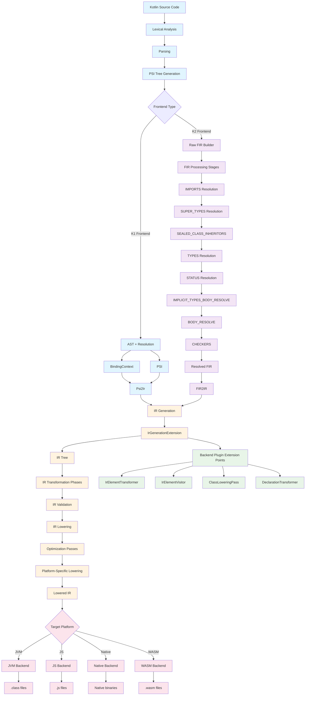
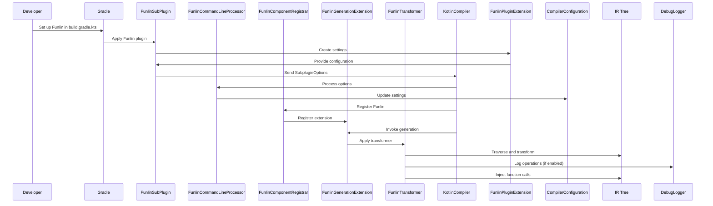

# Funlin Compiler Plugin Documentation

### Operational Flow Diagram

## Introduction

**Funlin** is a tool for Kotlin developers that automatically adds extra code to your functions. This helps you save time and avoid mistakes by doing repetitive tasks for you.

## What is Funlin?

Funlin is a **Kotlin compiler plugin**. It works with **Gradle**, a tool that builds your projects. Funlin looks for functions you mark with a special label (annotation) and adds a call to another function you choose.

## How Does Funlin Work?

Funlin works in easy steps. Here's how it does its job:

### Step 1: Set Up Funlin in Gradle

First, you add Funlin to your project's `build.gradle.kts` file. You can set options like turning Funlin on or off, enabling logging, choosing which label to look for, and selecting the function to call.

    funlin {
        enabled.set(true)
        logging.set(true)
        annotation.set("com.example.MyAnnotation")
        callableTargetPath.set("com.example.MyObject.myFunction")
    }

### Step 2: Gradle Reads the Settings

Gradle uses the **FunlinSubPlugin** to read the settings you made. This plugin knows how to send these settings to the Kotlin compiler.

### Step 3: Send Settings to the Kotlin Compiler

The Gradle plugin sends your settings to the Kotlin compiler using **SubpluginOption**. This tells the compiler what Funlin should do.

### Step 4: Compiler Processes the Settings

Inside the compiler, **FunlinCommandLineProcessor** takes your settings and prepares them. It makes sure Funlin is turned on and knows which label and target function to use.

### Step 5: Register the Code Modifier

**FunlinComponentRegistrar** tells the Kotlin compiler to use **FunlinGenerationExtension**. This extension is what changes your code.

### Step 6: Modify Your Code

**FunlinGenerationExtension** uses **FunlinTransformer** to go through your Kotlin code. It finds all functions with your chosen label and adds a call to your target function at the start of each annotated function.

## Components of Funlin

Here are the main parts of Funlin and what they do:

### 1. FunlinCommandLineProcessor

- **Where:** `de.thermondo.plugin`
- **What It Does:** Reads the settings you made in Gradle and updates the compiler's configuration.

### 2. FunlinComponentRegistrar

- **Where:** `de.thermondo.plugin`
- **What It Does:** Registers Funlin with the Kotlin compiler if it's turned on.

### 3. FunlinGenerationExtension

- **Where:** `de.thermondo.plugin`
- **What It Does:** Starts the process of changing your Kotlin code.

### 4. FunlinTransformer

- **Where:** `de.thermondo.transformations`
- **What It Does:** Finds functions with your chosen label and adds the extra function calls.

### 5. DebugLogger

- **Where:** `de.thermondo.util`
- **What It Does:** Logs messages to help you see what Funlin is doing, if logging is turned on.

### 6. FunlinPluginExtension & FunlinSubPlugin

- **Where:** `de.thermondo.gradle`
- **What They Do:** Let you set up Funlin in your Gradle build files.

## Potential Improvements

1. **Testing:**
    - Add tests to make sure Funlin works correctly.
    - Use testing tools for Kotlin and Gradle.
